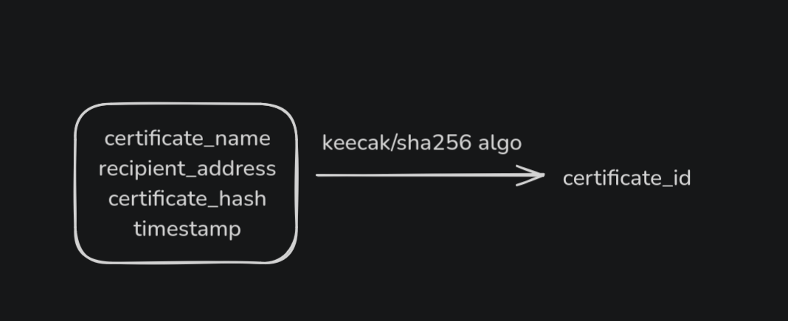
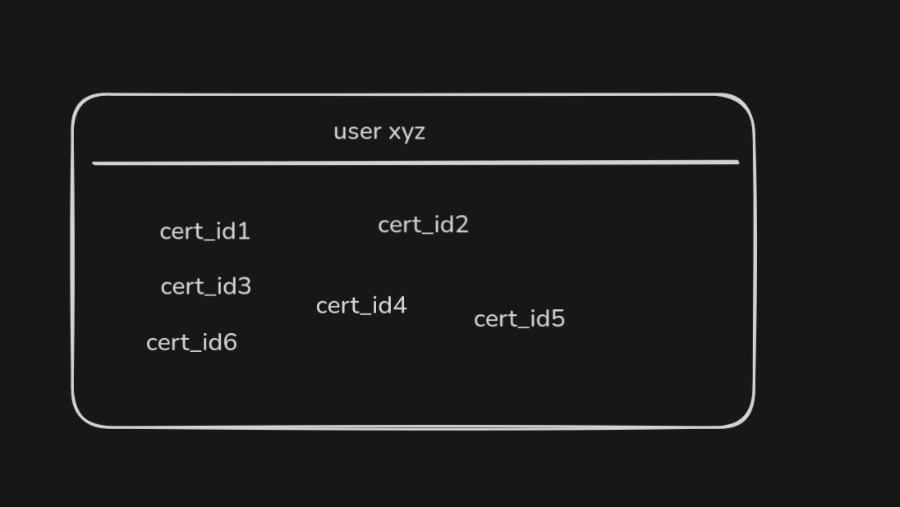
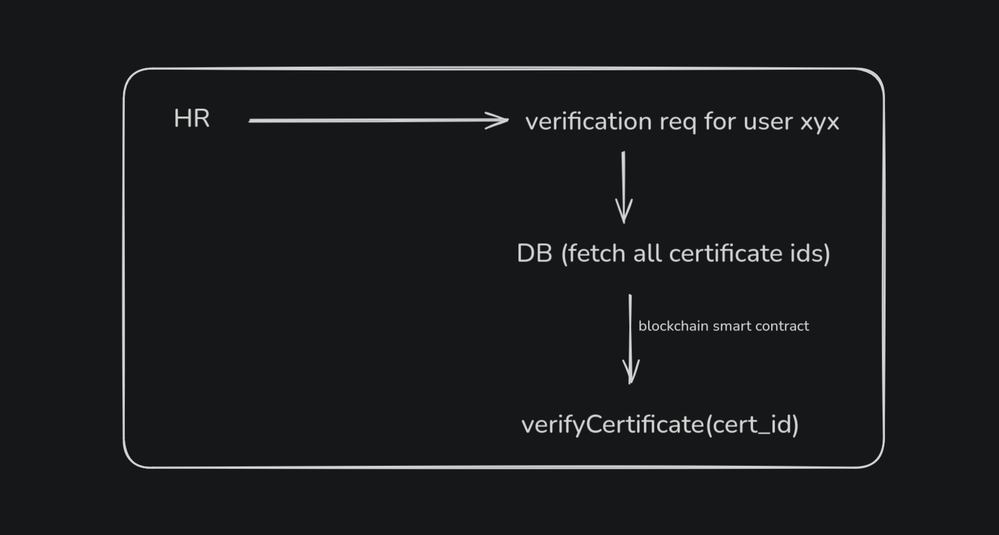

## **Decentralized Certificate Management System**  

A blockchain-based platform for issuing, managing, and verifying certificates securely.  

### **How It Works**  
📝 **Issue Certificate** – Organizations can generate and store certificates securely.  
📜 **User Certificates** – Users can view all their verified credentials.  
🔍 **Verify Certificate** – Employers and institutions can instantly validate authenticity.  

### **Screenshots**  
  
  
  
